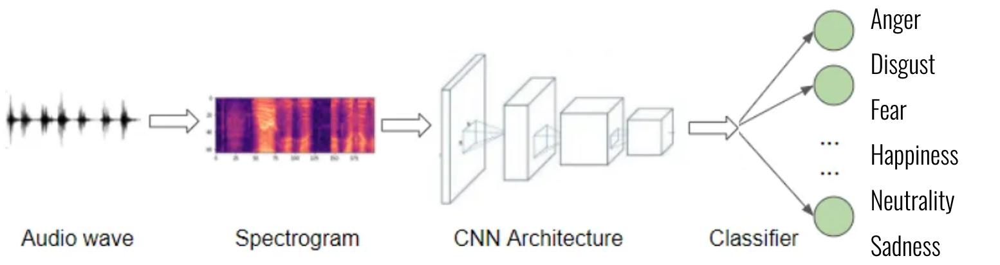

Catherine Sanso  
September 20, 2023  

# **Speech Emotion Recognition**

## Table of Contents:

1. [Background](#section-title)
1. [Problem Statement](#section-title) 
1. [Target Audience](#section-title)
1. [Research Approach](#section-title) 
1. [Data Dictionary](#section-title)
1. [Discussion & Recommendations](#section-title)
1. [Software Required](#section-title) 
1. [Sources](#section-title)
1. [Licensing](#section-title) 
 
# [Background](#section-title)
Speech emotion recognition (SER) is the process of predicting human emotions from audio signals using artificial intelligence (AI) and machine learning (ML) techniques. Human speech contains several features that a listener interprets to unpack the information transmitted by the speaker, such as tone, pitch, speed, and other acoustic properties. 

To classify speech based on emotion, audio data is first transformed to spectograms. A spectogram is the visual representation of the spectrum of frequencies of a signal as it varies with time. Spectograms are generated using the following steps:
1. The audio data is divided into short, overlapping time segments (typically 20-30 ms). Each frame is transformed into a spectogram separately.
2. The Short-Term Fourier Transform (STFT) was used for this project and is the most common method to create a spectogram. The STFT is a mathematical technique used to decompose a complex signal into its constituent sinusoidal components, revealing the frequency and phase information of those components. Spectograms build upon the STFT concept by providing a time-varying representation of frequency components. Applying the STFT to small segments of audio signals generates a spectogram display with time on the horizontal axis, frequency on the vertical, and the intensity of the color within the plot representing the magnitude of the strength (energy) of each frequency at a given time.
5. These spectograms are plotted and are used as image inputs to a Convolutional Neural Net (CNN).

CNN's are a deep learning model specifically designed to process audio data for tasks relating to speech recognition, music classification, and sound event detection. CNNs use convolutional layers to scan input data for local patterns at varying scales and locations, such as the spectral features within the spectogram plot. Pooling layers are then used to downsample the spatial dimensions of the feature maps produced by the convolutional layers, thereby reducing the number of parameters within the model. The next layer flattens the model to spatially reduce the feature map into a 1-Dimensional vector. The flattened feature vector is then passed through one or more fully connected layers to learn complex combinations of these features. Lastly, an output later is passed through an activation function (Softmax for multiclass classification problems such as this one) to obtain class probabilities. One particular CNN model used within this project is VGG16, a Visual Geometry Group consisting of 16 convolutional layers with a pre-established architecture. The VGG architecture is the basis of ground-breaking object recognition models and surpasses baselines on many tasks beyond its original Imagenet training data
   
There are a wide range of applications which broadly include speech recognition, music classification, and audio event detection. This can be applied across various domains to extract emotional information from spoken language. Some key applications include:
1. Human-Computer Interaction (HCI): to enhance interaction between humans and machines (such as Siri or Alexa).
2. Market Research: to analyze consumers' emotional responses from interviews or focus groups.
3. Financial: to understand the emotions and sentiments of market participants, such as from earning calls and financial news broadcasts, which influences stock prices.
4. Fraud Detection: to detect anomalies in speech patterns which may indicate fraudulent activities. 

# [Problem Statement](#section-title)
I am tasked with developing an emotion classification system using the CREMA-D Audio Dataset. The objective is to build a machine learning model that can accurately classify audio recordings into six distinct emotional categories: Anger, Disgust, Fear, Happiness, Neutral, and Sadness. 

The CREMA-D dataset stands for "Crowd Sourced Emotional Multimodal Actors Dataset". This dataset contains 7,442 original clips from 9 actors, of which 48 are male and 43 are female between the ages of 20-74. The ethnicities included are African-American, Asian, Caucasian, Hispanic, and Unspecified. The actors spoke up to 12 sentences using one of 6 emotions (anger, disgust, fear, happiness, neutrality, sadness) with 4 different levels of emotional intensity (low, medium, high, unspecified). 
- The dataset is compiled from __[CREMA-D Audio Emotion](https://www.kaggle.com/code/ejlok1/audio-emotion-part-1-explore-data/input)__.

While there are several metrics by which to measure a CNN's performance (such as accuracy, precision, recall, F1, etc), this model uses accuracy as a measure of the overall correctness of the model's predictions. Accuracy calculates the ratio of correctly classified audio samples to the total number of samples and is appropriate because the six classes are balanced. Because this multi-class classification CNN has six target outputs, the baseline accuracy per class would be ~17%. There are no universally fixed industry standards for success within CNN models, as this judgement varies by domain, task type, data complexity, and real-world performance limitations. For this project, the models will be considered successful if its accuracy on both the testing and validation sets exceed 90%.

# [Target Audience](#section-title)

This project targets a broad audience which includes researchers within the field of affective computing, machine learning, and artificial intelligence who are interested in advancing the state of speech emotion recognition and its contributions to academic research. The audience also includes developers of emotion-enabled applications, market researchers and advertisers, and content creators and media producers. 

# [Research Approach](#section-title)

The flow chart below shows the preprocessing and machine learning techniques used to create this multiclass CNN. 

# [Data Dictionary](#section-title)

The following terms and abbreviations are used throughout this project and are defined as follows:

| Item | Description
| --- | --- 
| **ANG** | *CREMA-D Emotion Type: Anger*
| **DIS** | *CREMA-D Emotion Type: Disgust*
| **FEA** | *CREMA-D Emotion Type: Fear*
| **HAP** | *CREMA-D Emotion Type: Happiness*
| **NEU** | *CREMA-D Emotion Type: Neutral*
| **SAD** | *CREMA-D Emotion Type: Sadness*
| **LOW** | *CREMA-D Emotion Level: Low*
| **MD** | *CREMA-D Emotion Level: Medium*
| **HI** | *CREMA-D Emotion Level: Hi*
| **XX** | *CREMA-D Emotion Level: Unspecified*
| **IEO** | *CREMA-D Sentence: It's Eleven O'Clock*
| **TIE** | *CREMA-D Sentence: That is exactly what happened* 
| **IOM** | *CREMA-D Sentence: I'm on my way to the meeting* 
| **IWW** | *CREMA-D Sentence: I wonder what this is about*
| **TAI** | *CREMA-D Sentence: The airplane is almost full* 
| **MTI** | *CREMA-D Sentence: Maybe tomorrow it will be cold* 
| **IWL** | *CREMA-D Sentence: I would like a new alarm clock* 
| **ITH** | *CREMA-D Sentence: I think I have a doctor's appointment* 
| **DFA** | *CREMA-D Sentence: Don't forget a jacket*
| **ITS** | *CREMA-D Sentence: I think I've seen this before*
| **TSI** | *CREMA-D Sentence: The surface is slick*
| **WSI** | *CREMA-D Sentence: We'll stop in a couple of minutes*
| **sample_rate** | *Number of samples taken per second*
| **rms** | *Root Mean Squared Value*
| **scv** | *Spectral Centroid Value*
| **sbv** | *Spectral Bandwidth Value*
| **sfv** | *Spectral Flatness Value*
| **srv** | *Spectral Rolloff Value*
| **tc** | *Tonal Centroid*
| **mzcr** | *Mean Zero Crossing Rate*

# [Discussion & Recommendations](#section-title)

The self-created CNN model and the VGG16 model both outperformed the baseline accuracy of ~17%. Because success was defined as a model exceeding 90% accuracy on the validation set, only the VGG16 model is considered successful. With 99% accuracy on the training set and 93% accuracy on the validaton set, the model shows overfitting which can be corrected by introducing more samples, sourcing more diverse audio, and creating further data augmentation to generalize the model.

The final CNN and VGG16 model sourced over 35,000 spectogram images from 7,447 audio files. However, the accuracy of the model did not improve significantly from previous iteratons of the model in which only ~9,000 images were inputted. This suggests that improvement is more easily achievable by sourcing more diverse audio snippets, rather than merely increasing the sample size.

The model was run with 10, 15, and 25 epochs and learning rates of 0.001 and 0.0001. In all instances, early stoppage was considered but the models always ran through all n iterations. While the models with 25 epochs produced the best results, the models with 15 epochs produced a similar (though slihlty less) accuracy metric and should be considered if the user has time constraints or computer hardware limitations. 

It is recommended that future iterations of this project include audio data from the RAVDESS, SAVEE, and TESS datasets which include different actors portraying a range of emotions. A limitation within this project is that all speech was spoken in a "netrual" North American accent, so sound data with regional dialects or accents should also be explored. Furher data augmentation can also enhance the model's performance by introducing more generalization. Audio-specific CNNs like YAMNet, VGGish, UrbanSound8k, and ESC-10 shoudl be explored. Lastly, ensemble learning can be used to combine the best-performing CNN model with other unsupervised learning techniques (such as K-Means Clustering produced by feature extraction of the dataframe) to further improve the model's performance metrics.

# [Software Required](#section-title)
The software required for this project are listed on the first line of code within each notebook and include: Pandas, Matplotlib, Seaborn, Librosa, IPython, and Scipy.

# [Sources](#section-title)

General:
- [CREMA-D Dataset](https://github.com/CheyneyComputerScience/CREMA-D)
- [NIH National Library of Medicine: CREMA-D Crowd-sourced Emotional Multimodal Actors Dataset](https://www.ncbi.nlm.nih.gov/pmc/articles/PMC4313618/)
- [Librosa](https://librosa.org/doc/latest/index.html)
- [TensorFlow](https://www.tensorflow.org/api_docs/python/tf)
- [Medium: Audio Signal Feature Extraction](https://medium.com/heuristics/audio-signal-feature-extraction-and-clustering-935319d2225)
- [VGG15](https://viso.ai/deep-learning/vgg-very-deep-convolutional-networks/)
- [SaturnCloud](https://saturncloud.io/blog/how-to-implement-convolutional-neural-network-cnn-for-audio/)
- [MDPI Speech Emotion Recognition through Hybrid Features and Convolutional Neutral Network](https://www.mdpi.com/2076-3417/13/8/4750#:~:text=Speech%20emotion%20recognition%20(SER)%20is,medicine%2C%20education%2C%20and%20entertainment)
- [Speech Representation and Data Exploration](https://www.kaggle.com/code/davids1992/speech-representation-and-data-exploration)
- General Assembly Notes & Lecture
- Stack Overflow & ChatGPT

# [Licensing](#section-title)
This project is licensed under the MIT license.
